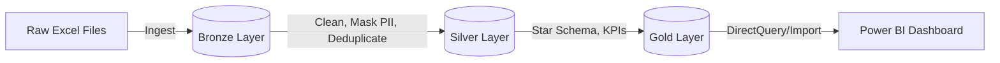

# ✈️ ASG Airlines: End-to-End Data Engineering Pipeline


---

## 📖 Project Overview

**ASG Airlines** operates flights across multiple cities, collecting operational data from booking platforms, scheduling systems, and airport logs. However, the raw data suffers from severe quality issues, including:

- Corrupted flight identifiers
- Inconsistent time formats
- Missing values
- Unhandled overnight (cross-day) flight scenarios

This project implements a robust, **end-to-end data engineering pipeline** using the **Medallion Architecture (Bronze, Silver, Gold)** that:
- Ingests raw data
- Applies strict data quality checks
- Masks sensitive PII
- Calculates complex business logic (overnight flight durations)
- Models data into a **Star Schema** for interactive Power BI dashboards

---

## 🏗️ Architecture & Tech Stack

**Data Processing:**
- Python 3.10+
- Pandas, PyArrow

**Data Storage:**
- Parquet (Columnar format for high performance)

**Data Modeling:**
- Star Schema (Fact & Dimension tables)

**Visualization:**
- Microsoft Power BI Desktop

**Version Control:**
- Git & GitHub

### Data Flow Diagram



---

## 📁 Project Structure

```
ASG-Airlines-Data-Pipeline/
├── src/
│   ├── ingestion/              # Scripts to read raw data into Bronze layer
│   ├── transformation/         # Data cleaning, PII masking, and Silver layer logic
│   └── loading/                # Gold layer modeling and KPI aggregation
├── data/
│   ├── raw/bronze/             # Raw, unmodified parquet files
│   ├── cleaned/silver/         # Cleaned, masked, and standardized data
│   └── mart/gold/              # Business-ready Fact and Dimension tables
├── powerbi/                    # Power BI .pbix file and dashboard screenshots
├── docs/                       # Architecture diagrams and data dictionary
├── requirements.txt            # Python dependencies
└── README.md                   # Project documentation
```

---

## 🔧 Key Data Transformations & Business Logic

### 1. 🌙 Overnight Flight Duration Calculation

A major challenge was calculating flight durations for overnight flights where the `arrival_time` is chronologically before the `departure_time` on a 24-hour clock.

**Solution:**
- If `arrival_time < departure_time`, add 24 hours (1 day) to the arrival time before calculating the delta
- **Result:** Accurate `calculated_duration_hours` for all flights, preventing negative duration anomalies

### 2. 🔒 PII Masking & Privacy Compliance

To comply with data privacy standards (GDPR/DPDP), sensitive passenger information in the Silver layer is heavily protected:

| Field | Masking Strategy |
|-------|------------------|
| Aadhaar ID | Irreversibly hashed using SHA-256 |
| Passport Number | Masked to show only last 4 characters (e.g., `XXXXXX1234`) |
| Phone Numbers | Masked to protect middle digits (e.g., `+91-XXXXX5678`) |
| Email Addresses | Pseudonymized (e.g., `j***@gmail.com`) |

### 3. 🧹 Data Quality & Standardization

- **Corrupted IDs:** Standardized `flight_id` by stripping special characters and enforcing uppercase formatting
- **Invalid Statuses:** Mapped INVALID or missing booking statuses to UNKNOWN or CANCELLED based on business rules
- **Payment Anomalies:** Coerced INVALID and missing payment amounts to NaN and flagged them for exclusion from revenue calculations
- **Deduplication:** Removed exact duplicate records across all entities (Flights, Bookings, Passengers)

---

## 📊 Business KPIs & Data Modeling (Gold Layer)

The Silver data is transformed into a **Star Schema** optimized for Power BI, featuring:

### Fact Tables
- `fact_bookings` – Booking transactions and metrics
- `fact_payments` – Payment records and revenue data

### Dimension Tables
- `dim_flight` – Flight details (airline, route, duration)
- `dim_passenger` – Passenger information

### Key Metrics Calculated
- **Average Flight Duration:** Grouped by Airline and Route
- **Route-wise Traffic:** Total bookings and revenue per Source-Destination pair
- **Delay/Anomaly Detection:** Flights with durations > 4 hours flagged as long-haul anomalies
- **Cancellation Rate:** Percentage of cancelled bookings per airline
- **Total Revenue:** Aggregated from valid payment records

---

## 📈 Power BI Dashboard

The final output is an interactive, multi-page Power BI dashboard designed for ASG Airlines operational stakeholders.

### Dashboard Pages

1. **Executive Summary**
   - High-level KPI cards (Total Bookings, Revenue, Avg Duration, Cancellation Rate)

2. **Duration & Anomaly Insights**
   - Histograms and scatter plots identifying flight duration outliers

3. **Route Performance**
   - Geographical mapping and matrix views of busiest and most profitable routes

4. **Airline Trends**
   - Market share distribution and comparative performance across airlines (IndiGo, Air India, SpiceJet, Vistara)


---

## 🚀 How to Run the Pipeline

### Prerequisites
- Python 3.10+
- Git
- Virtual environment (recommended)

### Installation & Execution

**1. Clone the repository:**

```bash
git clone https://github.com/Ritanshu1104/ASG-Airlines-Data-Pipelines.git
cd ASG-Airlines-Data-Pipeline
```

**2. Create a virtual environment and install dependencies:**

```bash
python -m venv venv
source venv/bin/activate  # On Windows: venv\Scripts\activate
pip install -r requirements.txt
```

**3. Place the source data file:**
- Add `UseCase - Airlines.xlsx` to the root directory

**4. Run the pipeline stages in order:**

```bash
# Stage 1: Ingest to Bronze
python src/ingestion/ingest_bronze.py

# Stage 2: Transform to Silver
python src/transformation/transform_silver.py

# Stage 3: Load to Gold
python src/loading/load_gold.py
```

**5. Open Power BI Dashboard:**
- Open `powerbi/ASG_Airlines_Dashboard.pbix` in Power BI Desktop to view the analytics

---

## 🛡️ Security & Access Control

- **Data at Rest:** Raw PII is never persisted in the Gold layer or Power BI dataset
- **Row-Level Security (RLS):** In production, RLS restricts access so regional managers see only their airport hub data
- **Credential Management:** Database connection strings and API keys are managed via environment variables (`.env`) and strictly ignored by Git

---

## 📦 Dependencies

All required packages are listed in `requirements.txt`:

```
pandas
pyarrow
openpyxl
```

Install with:
```bash
pip install -r requirements.txt
```

---

## 👨‍💻 Author

**Ritanshu**

- [GitHub Profile](https://github.com/Ritanshu1104)

---

## 📝 License

This project is licensed under the **MIT License** – see the LICENSE file for details.

---

## 📞 Support & Feedback

For questions, issues, or feedback, please open an issue on GitHub or contact the project author.
